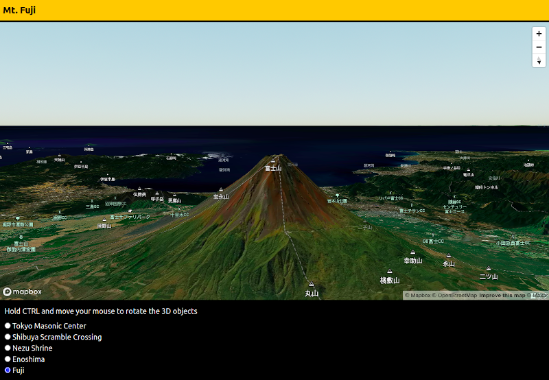

# mapbox-gl-js-v2-experiment

Mapbox GL JS v2 experiment.

[1. About](#1-about)  
[2. What I Did](#3-what-i-did)  
&nbsp; &nbsp; [2-1. Installed NPM Packages All](#2-1-installed-npm-packages-all)  
&nbsp; &nbsp; [2-2. Babel](#2-2-babal)  
&nbsp; &nbsp; [2-3. Webpack](#2-3-webpack)  
&nbsp; &nbsp; [2-4. Other Build Tools](#2-4-other-build-tools)  
&nbsp; &nbsp; [2-5. Other Dependencies](#2-5-other-dependencies)  
[3. Dev & Build](#3-dev--build)  
[4. LICENSE](#4-license)  



[View Demo](http://tokyo800.jp/mina/mapbox-gl-js-v2-experiment/)  


<a id="about"></a>
## 1. About

Playing with Mapbox GL JS v2.  

Some fancy features:
- No React
- Tailwind
- A bit of Functional Programming

&nbsp;


## 2. What I Did

### 2-1. Installed NPM Packages All


```
yarn add ramda mapbox-gl

yarn add --dev @babel/core @babel/cli @babel/preset-env core-js@3 @babel/runtime-corejs3 webpack webpack-cli webpack-dev-server babel-loader file-loader css-loader style-loader postcss-loader webpack-merge clean-webpack-plugin html-webpack-plugin copy-webpack-plugin mini-css-extract-plugin license-webpack-plugin postcss autoprefixer tailwindcss prettier http-server
```

### 2-2. Babel

- @babel/core
- @babel/cli
- @babel/preset-env
- core-js@3
  - For `@babel/polyfill` has been deprecated.
- @babel/runtime-corejs3
- babel-loader
  - Always handy having definitions in `.babelrc` (or `babel.config.js`).

```
yarn add --dev @babel/core @babel/preset-env @babel/cli core-js@3 @babel/runtime-corejs3 babel-loader
```


### 2-3. Webpack

- webpack
- webpack-cli
- webpack-dev-server
- file-loader
- css-loader
- style-loader
  - This is for development only. For production, we are using `mini-css-extract-plugin`.
- postcss-loader
  - We definitely need this when using Tailwind.

```
yarn add --dev webpack webpack-cli webpack-dev-server file-loader css-loader style-loader postcss-loader
```

### 2-4. Other Build Tools

- dotenv
  - API TOKENS for Mapbox are stored in `.env` and `.env.local`. Although they will be included in bundle files anyways, I have IP restrictions for API TOKENS, and no problem.
- webpack-merge
- clean-webpack-plugin
- html-webpack-plugin
- copy-webpack-plugin
- mini-css-extract-plugin
  - While we are extracting CSS files, and write them to disks, this is for production only.
- license-webpack-plugin
- postcss
  - We definitely need this when using Tailwind.
- autoprefixer
- prettier
- http-server
  - May worth nothing. Yet, I can check behaviors for the built bundles before I deploy to the production.

```
yarn add --dev webpack-merge clean-webpack-plugin html-webpack-plugin license-webpack-plugin postcss autoprefixer prettier http-server
```

### 2-5. Other Dependencies

- ramda
  - Makes our lives easier for functional programming.
- tailwindcss  
  - Since we are not using React this time, we're not using `twin.macro` nor `emotion`, but a plain `tailwind`. See how easy it is to setup. Make sure we have `postcss.config.js`.
- mapbox-gl
  - This is our main recipe.

```
yarn add ramda mapbox-gl

yarn add --dev tailwindcss
```

&nbsp;


## 3. Dev & Build

### Build for DEV

```
yarn start
```

### Build for PROD

```
yarn build
```

&nbsp;


## 4. License

Dual-licensed under either of the followings.  
Choose at your option.

- The UNLICENSE ([LICENSE.UNLICENSE](LICENSE.UNLICENSE))
- MIT license ([LICENSE.MIT](LICENSE.MIT))


